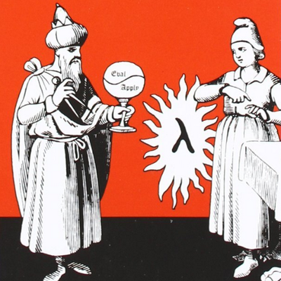

# UC Berkeley CS 61A



These video lectures from [Spring
2010](https://www.youtube.com/watch?v=4leZ1Ca4f0g&list=PLhMnuBfGeCDNgVzLPxF9o5UNKG1b-LFY9&index=1)
cover the SICP material using Scheme.

The lectures are amazing and you build knowledge step by step around
several programming concepts. This repository will be used only to
save and document the work I am doing on these lectures.

I also implement some functions in order to practice as I go, or even
the professor mentioned it could/should be done, or I have any idea or
curiosity about something specific.

Again, this is solely a tracking system for me right now. As the
images of the course are reallly bad might be useful for you to check
any implementation here.


## Installation

I installed `stklos` from AUR in ArchLinux. 

``` shell
yaourt -S stklos
```

and them downloaded the `simply.scm` file from
[berkeley](https://people.eecs.berkeley.edu/~bh/ssch27/appendix-running.html)
in order to have the same custom constructs that is presented in the
lectures. The file is also inside this repository.

I am using Emacs, and needed to perform one more setup:

``` emacs-lisp
(setq scheme-program-name "stklos")
```

And then, you can open any `.scm` file and run `M-x run-scheme` which
will open a new buffer REPL.

Inside the REPL, load the `simply.scm` lisp file.

``` scheme
(load "path-to-simply.scm")
```

Ready to go!
